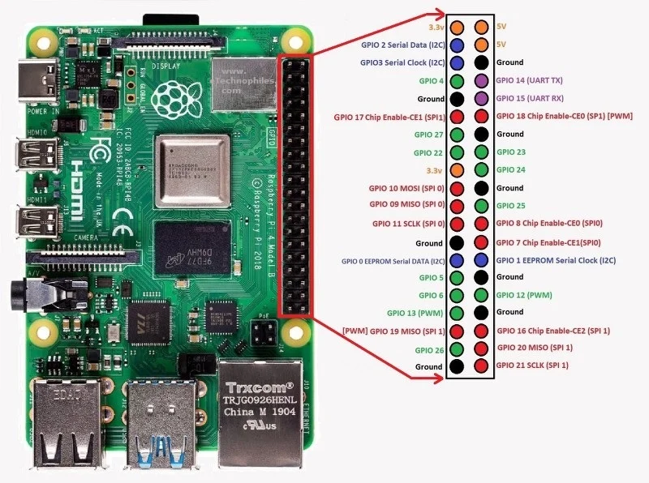
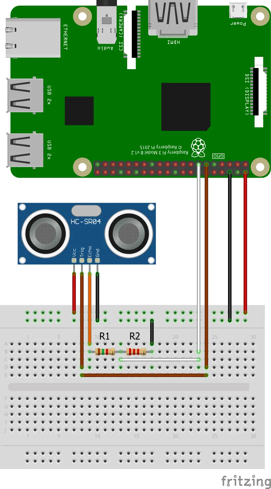
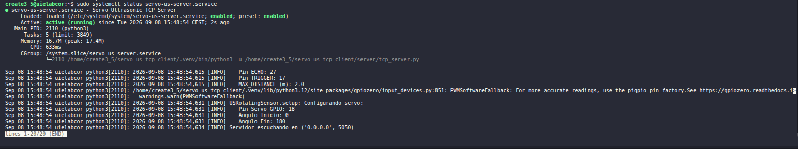

# Laboratory Setup

Guía de instalación y despliegue del servidor `servo-us-tcp-client` en una Raspberry Pi destinada a su uso en el Laboratorio de Ingeniería.

## Requisitos hardware

### Raspberry Pi

* Raspberry Pi 4 o superior
* Tarjeta microSD con Ubuntu Server instalado
* Conectividad de red local

### Sensor de Ultrasonidos

* HC-SR04 o compatible

### Servomotor

* Servo de 180º compatible con control `PWM`

### Componentes adicionales

* Protoboard
* Cables Dupont
* Divisor de tensión para la señal `ECHO` del HC-SR04

## Requisitos software

### Sistema operativo

Entorno validado:

```text
Ubuntu 24.04.4 LTS (Noble Numbat)
Python 3.12.3
```

### Herramientas necesarias

```bash
sudo apt update
sudo apt install git python3-venv -y
```

## Clonado del repositorio

```bash
cd ~

git clone https://github.com/UIE-Laboratorio-Ingenieria/servo-us-tcp-client.git

cd servo-us-tcp-client
```

## Creación del entorno virtual

```bash
python3 -m venv .venv

source .venv/bin/activate
```

Actualizar pip:

```bash
pip install --upgrade pip
```

## Instalación de dependencias

```bash
pip install -r server/requirements.txt
```

Verificación:

```bash
python -c "import gpiozero; print('gpiozero OK')"
python -c "import lgpio; print('lgpio OK')"
```

Salida esperada:

```text
gpiozero OK
lgpio OK
```

## Conexión del hardware

### Raspberry Pi 4 - GPIO Pinout

<figure>
     <center>
     
     <figcaption>Raspberry Pi - Header</figcaption>
     </center>
</figure>

### Conexión del servo motor

| Servo | Raspberry Pi |
|----------|----------|
| Señal PWM | GPIO18 |
| VCC | 5V |
| GND | GND |

### Conexión del sensor de ultrasonidos HC-SR04

| HC-SR04 | Raspberry Pi |
|----------|----------|
| VCC | 5V |
| GND | GND |
| TRIG | GPIO17 |
| ECHO | GPIO27 |

### Divisor de tensión para `ECHO`

El pin ECHO del HC-SR04 trabaja a 5V. Debe utilizarse un divisor de tensión antes de conectarlo al GPIO27.

Valores recomendados:

```text
R1 = 1 kΩ
R2 = 2 kΩ
```

Esquema:
```text
              R1 1kΩ
ECHO ----+----/\/\/\----+
         |              |
         |              +---- GPIO27
         |
         +----/\/\/\----+
              R2 2kΩ    |
                        |
                       GND
```

<figure>
     <center>
     
     <figcaption>Raspberry Pi 4 - HC-SR04 wiring</figcaption>
     </center>
</figure>

## Arranque manual

### Activar el servidor en la Raspberry Pi

Activar el entorno virtual

```bash
source .venv/bin/activate
```

Ejecutar el servidor:

```bash
python server/tcp_server.py
```

Salida esperada:

```text
Servidor escuchando en ('0.0.0.0', 5050)
```

### Verificación desde un cliente

Configurar el archivo `config.ini`

```ini
[server]
host = IP_DE_LA_RASPBERRY
port = 5050 
```

Ejecutar

```bash
python client/tcp_client.py
```

La salida debe mostrar

```text
Giro servo raw ...
Giro servo ...
Distancia ...
Barrido ...
```

## Instalación del servicio systemd

Crear:

```bash
sudo nano /etc/systemd/system/servo-us-server.service
```

Contenido:

```ini
[Unit]
Description=Servo Ultrasonic TCP Server
After=network.target
Wants=network-online.target

[Service]
Type=simple
User=create3_5
WorkingDirectory=/home/create3_5/servo-us-tcp-client

ExecStart=/home/create3_5/servo-us-tcp-client/.venv/bin/python3 -u /home/create3_5/servo-us-tcp-client/server/tcp_server.py
Restart=on-failure
RestartSec=5
StandardOutput=journal
StandardError=journal
 
[Install]
WantedBy=multi-user.target
```

Recargar la configuración:

```bash
sudo systemctl daemon-reload
```

Habilitar arranque automático:
```bash
sudo systemctl enable servo-us-server.service
```

El servicio se iniciará automáticamente en cada arranque de la Raspberry Pi.

Arrancar:
```bash
sudo systemctl start servo-us-server.service
```

Verificar:
```bash
sudo systemctl status servo-us-server.service
```

<figure>
     <center>
     
     <figcaption>Estado del servicio</figcaption>
     </center>
</figure>

## Comprobación tras reinicio

Reiniciar la Raspberry Pi:
```bash
sudo reboot
```

Comprobar:
```bash
sudo systemctl status servo-us-server.service
```

Verificar puerto TCP:
```bash
ss -tlnp | grep 5050
```

Salida esperada:

```bash
0.0.0.0:5050
```

## Checklist final

- [ ] Ubuntu instalado.
- [ ] Repositorio clonado.
- [ ] Entorno virtual creado.
- [ ] Dependencias instaladas.
- [ ] Puerto TCP 5050 accesible desde la red local.
- [ ] HC-SR04 conectado.
- [ ] Servo conectado.
- [ ] Servidor arranca manualmente.
- [ ] Cliente conecta correctamente.
- [ ] Servicio systemd instalado.
- [ ] Servicio arranca automáticamente tras reinicio.
- [ ] Servicio `servo-us-server.service` en estado `active (running)`.