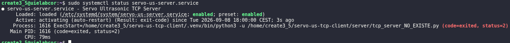
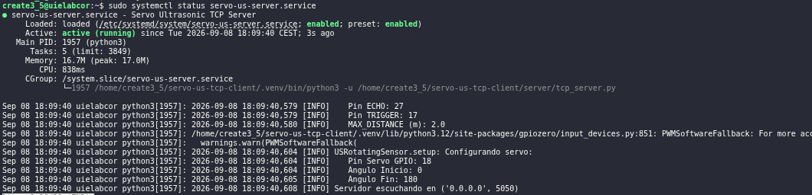
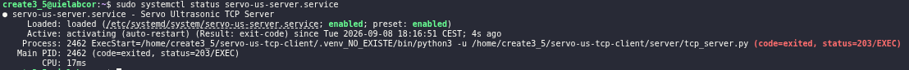

# Troubleshooting

Este documento recopila los problemas más habituales detectados durante la instalación, configuración y operación de `servo-us-tcp-client`, junto con sus posibles soluciones.

# 1. Cliente TCP

## 1.1. El cliente no puede conectar con el servidor

### Síntoma

```text
OSError: [Errno 113] Connect call failed
```

<figure><center>
    
</center></figure>

### Posibles causas

- La dirección IP configurada en `config.ini` es incorrecta.
- La Raspberry Pi no está conectada a la red
- El servidor TCP no está en ejecución.
- El puerto TCP 5050 no está accesible.
- Existe un cortafuegos bloqueando la comunicación.

### Verificaciones

Comprobar la ip configurada en `config.ini`:

```bash
cat config.ini
```

Comprobar el puerto TCP:

```bash
ss -tlnp | grep 5050
```

```bash
nc -vz IP_SERVIDOR 5050
```

Comprobar el estado del servidor:
```bash
sudo systemctl status servo-us-server.service
```

## 1.2. Error al resolver la dirección del servidor

### Síntoma

```text
socket.gaierror: [Errno -2] Name or service not known
```
<figure><center>
    
</center></figure>

### Causa

Configuración incorrecta en `config.ini`.

* Hostname inexistente.
* IP mal escrita.
* Caracteres extraños.
* Comillas mal puestas.

Incorrecto:

```ini
[server]
host = "10.10.12.169"
port = 5050
```

Correcto:

```ini
[server]
host = 10.10.12.169
port = 5050
```

## 1.3. El cliente utiliza una IP incorrecta

### Verificación

```bash
cat config.ini
```

### Solución

```ini
[server]
host = IP_DE_LA_RASPBERRY
port = 5050
```

# 2. Servidor TCP

## 2.1. El servidor entra en bucle de reinicio

### Sintoma:

<figure><center>
    
</center></figure>

### Causa:

La ruta definida en ExecStart apunta a un fichero inexistente, por lo tanto `Python` no puede localizar el script, `systemd` intenta reiniciarlo y el servicio entra en auto-restart automaticamente.

### Verificación

* Comprobar el estado

```bash
sudo systemctl status servo-us-server.service
```

* Consultar los registros:

```bash
sudo journalctl -u servo-us-server.service -n 50
```

* Verificar que el fichero existe

```bash
ls -l /home/create3_5/servo-us-tcp-client/server/
```

### Solución:

Editar el servicio:

```bash
sudo nano /etc/systemd/system/servo-us-server.service
```

Corregir la linea del `ExecStart`:

```bash
ExecStart=/home/create3_5/servo-us-tcp-client/.venv/bin/python3 -u /home/create3_5/servo-us-tcp-client/server/tcp_server.py
```

Recargar `systemd`

```bash
sudo systemctl daemon-reload
```

Reiniciar el servicio

```bash
sudo systemctl restart servo-us-server.service
```

Comprobar el correcto funcionamiento

```bash
sudo systemctl status servo-us-server.service
```

<figure><center>
    
</center></figure>

## 2.2. El servicio no encuentra el entorno virtual

### Síntoma

<figure><center>
    
</center></figure>


### Causa

El fallo se produce porque el intérprete de Python definido en el `ExecStart` del servicio no existe. Es un error muy comun cuyas causas más comunes son:

* Se borra la carpeta .venv
* Se mueve el proyecto de ubicación
* Se reinstala Python
* Se restaura una copia incompleta del repositorio.

### Verificación

Comprobar el estado del servicio:

```bash
sudo systemctl status servo-us-server.service
```

Comprobar que existe el intérprete:

```bash
ls -l /home/create3_5/servo-us-tcp-client/.venv/bin/python3
```

### Solución

Editar el fichero de servicio:

```bash
sudo nano /etc/systemd/system/servo-us-server.service
```

Corregir la linea del `ExecStart`:

```bash
ExecStart=/home/create3_5/servo-us-tcp-client/.venv/bin/python3 -u /home/create3_5/servo-us-tcp-client/server/tcp_server.py
```

Recargar `systemd`

```bash
sudo systemctl daemon-reload
```

Reiniciar el servicio

```bash
sudo systemctl restart servo-us-server.service
```

Comprobar el correcto funcionamiento

```bash
sudo systemctl status servo-us-server.service
```

<figure><center>
    
</center></figure>

## 2.3. Error: No module named 'protocol'

### Síntoma

<figure><center>
    
</center></figure>

### Causa

El archivo `common/protocol.py` no puede localizarse desde `server/tcp_server.py`

Esto suele ocurrir cuando:

* Se ha movido `protocol.py` a otra carpeta.
* Se ha eliminado o modificado el bloque `sys.path.append(...)`
* La estructura del repositorio no coincide con la esperada.
* Se ejecuta el script desde una ubicación incorrecta

### Verificación

Comprobar que el fichero existe

```bash
ls -l common/protocol.py
```

Comprobar que `tcp_server.py` contiene:

```bash
sys.path.append(
    os.path.join(
        os.path.dirname(__file__),
        "..",
        "common"
    )
)
```

Comprobar la estructura del repositorio

```bash
tree -L 2
```

Salida esperada

```text
servo-us-tcp-client/
├── client/
├── common/
│   └── protocol.py
├── server/
│   ├── tcp_server.py
│   └── us_rotating_sensor.py
└── ...
```

### Solución

Añadir o restaurar el bloque

```bash
sys.path.append(
    os.path.join(
        os.path.dirname(__file__),
        "..",
        "common"
    )
)
```

antes del `import`

```bash
from protocol import Request, Response, send_framed, recv_framed
```

Verificar posteriormente ejecutando

```python
python server/tcp_server.py
```
Si el problema está resuelto, el servidor debería continuar con la inicialización normal y mostrar:

```text
Servidor escuchando en ('0.0.0.0', 5050)
```


## Error: No module named 'server'

### Síntoma

```text
ModuleNotFoundError: No module named 'server'
```

### Solución

Utilizar:

```python
from us_rotating_sensor import USRotatingSensor
```

en lugar de:

```python
from server.us_rotating_sensor import USRotatingSensor
```

## El puerto 5050 ya está en uso

### Síntoma

```text
Address already in use
```

### Verificación

```bash
ss -tlnp | grep 5050
```

### Solución

Identificar el proceso responsable:

```bash
sudo lsof -i :5050
```

# Sensor ultrasónico HC-SR04

## El sensor devuelve siempre 200 cm

### Posibles causas

- Sensor desconectado.
- Cableado incorrecto.
- Pin ECHO mal conectado.
- Distancia fuera del rango de medida.

### Verificaciones

```text
TRIG -> GPIO17
ECHO -> GPIO27
VCC  -> 5V
GND  -> GND
```

## Lecturas erráticas o inestables

### Posibles causas

- Divisor resistivo incorrecto.
- Mala alimentación.
- Reflexiones múltiples.
- Sensor mal fijado.

### Divisor de tensión recomendado

```text
R1 = 1 kΩ
R2 = 2 kΩ
```

## El sensor no responde

### Comprobación básica

Ejecutar:

```bash
python client/tcp_client.py
```

Si las llamadas a `LecturaUScmRaw()` o `LecturaUScm_Filtrada()` fallan, revisar el cableado.

# Servomotor

## El servo no gira

### Verificaciones

```text
SIGNAL -> GPIO18
VCC    -> 5V
GND    -> GND
```

### Posibles causas

- Alimentación insuficiente.
- Masa común desconectada.
- Error de cableado.

## El servo vibra constantemente

### Posibles causas

- Alimentación inestable.
- Ruido eléctrico.
- Montaje mecánico incorrecto.

### Solución

Comprobar alimentación y fijación mecánica.

# GPIO / LGPIO

## Error: Unable to load any default pin factory

### Síntoma

```text
gpiozero.exc.BadPinFactory: Unable to load any default pin factory!
```

### Causa

GPIO Zero no encuentra un backend GPIO válido.

### Verificación

```bash
python -c "import lgpio; print('lgpio OK')"
```

### Solución

Instalar dependencias:

```bash
pip install -r server/requirements.txt
```

## Error relacionado con PiGPIOFactory

### Síntoma

```text
failed to connect to localhost:8888
```

### Causa

Dependencia de `pigpiod`.

### Solución adoptada en este proyecto

El proyecto utiliza el backend por defecto de GPIO Zero (`LGPIO`) y no requiere `pigpiod`.

# systemd

## El servicio no existe

### Síntoma

```text
Unit servo-us-server.service could not be found.
```

### Verificación

```bash
ls /etc/systemd/system/ | grep servo
```

## El servicio no arranca

### Verificación

```bash
sudo systemctl status servo-us-server.service
```

```bash
sudo journalctl -u servo-us-server.service -n 50
```

## El servicio entra en bucle de reinicio

### Síntoma

```text
Active: activating (auto-restart)
```

### Posibles causas

- Hardware desconectado.
- Puerto ocupado.
- Error de Python.
- Dependencias ausentes.

## Se modifica el fichero .service y los cambios no tienen efecto

### Solución

```bash
sudo systemctl daemon-reload
sudo systemctl restart servo-us-server.service
```

## El servicio arranca manualmente pero no mediante systemd

### Verificación

```bash
sudo systemctl cat servo-us-server.service
```

Comprobar:

```ini
WorkingDirectory=
ExecStart=
```

# Red

## El puerto TCP no es accesible desde otro equipo

### Verificación

```bash
nc -vz IP_SERVIDOR 5050
```

```bash
ss -tlnp | grep 5050
```

### Posibles causas

- Servicio detenido.
- Firewall.
- Dirección IP incorrecta.
- Problemas de red.

# Comprobación rápida del sistema

## Estado del servicio

```bash
sudo systemctl status servo-us-server.service
```

## Puerto TCP

```bash
ss -tlnp | grep 5050
```

## Cliente

```bash
python client/tcp_client.py
```

## Arranque automático

```bash
sudo systemctl is-enabled servo-us-server.service
```

Salida esperada:

```text
enabled
```
